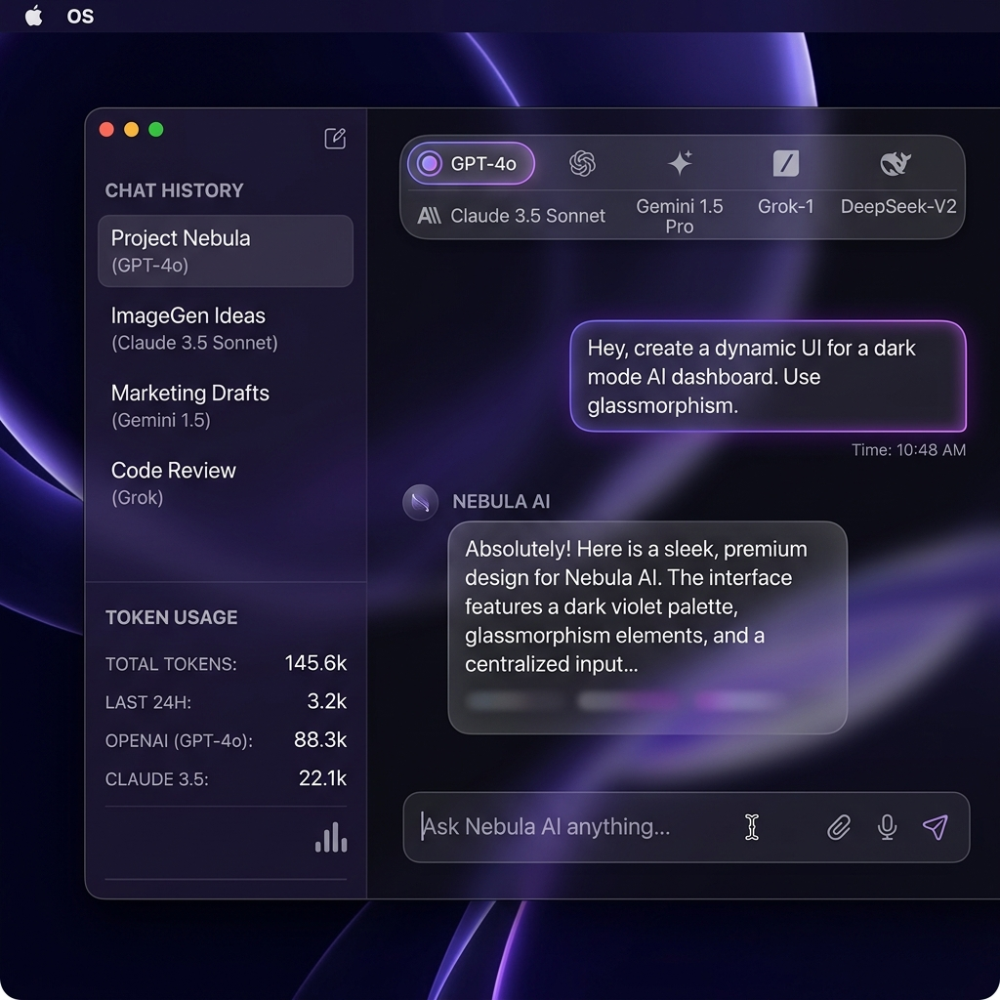

# TokenMonitor AI
TokenMonitor AI is a powerful, full-stack application that provides a unified chat interface for the "Famous Five" top-tier AI models while actively monitoring your token usage and API costs in real-time.



## ✨ Features

- **Unified Chat Interface**: Seamlessly chat with the world's best AI models from a single beautifully designed dashboard.
- **The "Famous Five"**: Native support for **OpenAI (GPT-4o)**, **Anthropic (Claude 3.5 Sonnet)**, **Google (Gemini 1.5/2.0)**, **xAI (Grok)**, and **DeepSeek**.
- **Real-time Cost Tracking**: Instantly see how much each message costs with per-token breakdowns.
- **Budget Management**: Set monthly spending limits and get visual alerts as you approach your quota.
- **Secure Key Storage**: API keys are encrypted at rest using AES-256-GCM before being stored in the database.
- **Streaming Responses**: Ultra-fast WebSocket integration for real-time text generation and token counting.

## 🛠 Tech Stack

**Frontend:**
- React 18 (via Vite)
- TailwindCSS (Styling)
- Lucide React (Icons)
- Context API (State Management)

**Backend:**
- Node.js & Express
- MongoDB (Mongoose)
- Socket.io (Real-time chat streaming)
- Official SDKs (OpenAI, Anthropic, Google Generative AI)
- Crypto (AES Encryption)

## 🚀 Getting Started

### Prerequisites
- [Node.js](https://nodejs.org/) (v18+)
- [MongoDB](https://www.mongodb.com/) (Local or Atlas URL)

### 1. Clone & Install
```bash
# Clone the repository
git clone https://github.com/yourusername/tokenmonitor-ai.git
cd tokenmonitor-ai

# Install backend dependencies
cd server
npm install

# Install frontend dependencies
cd client
npm install
```

### 2. Environment Setup

**Backend Configuration:**
Navigate to the `server` directory and duplicate `.env.example` to `.env`:
```bash
cp .env.example .env
```
Update your `.env` with your MongoDB URI, a 32-character encryption secret, and your API keys (optional, can also be configured in the UI).

**Frontend Configuration:**
Navigate to the `client` directory and duplicate `.env.example` to `.env`:
```bash
cp .env.example .env
```

### 3. Run the Development Servers

You will need to run both the frontend and backend servers.

**Terminal 1 (Backend):**
```bash
cd server
npm run dev
# Server runs on http://localhost:5000
```

**Terminal 2 (Frontend):**
```bash
cd client
npm run dev
# Client runs on http://localhost:5173
```

## 🔒 Security Note
Your API keys are entered directly into the client Settings page. They are transmitted securely, encrypted on the backend, and never logged in plain text. However, always be mindful when deploying applications that handle billing-tied API keys.

## 📄 License
This project is licensed under the MIT License.
